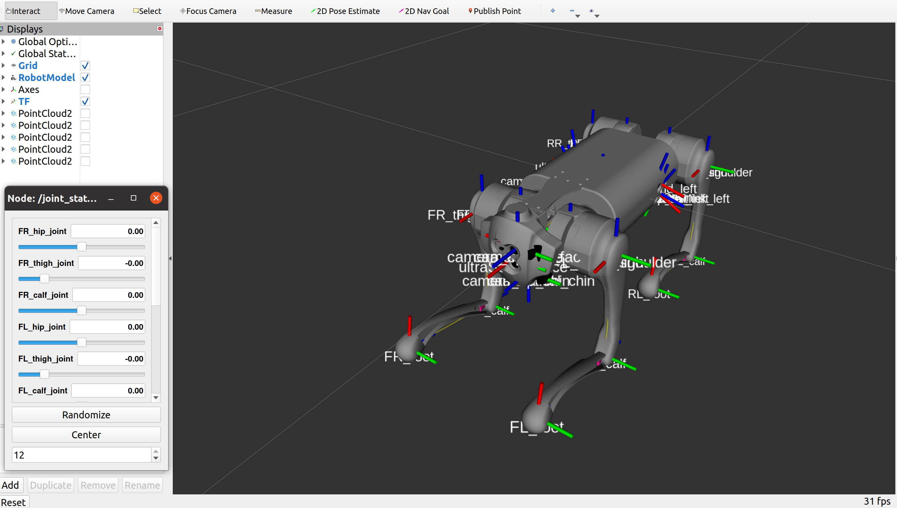
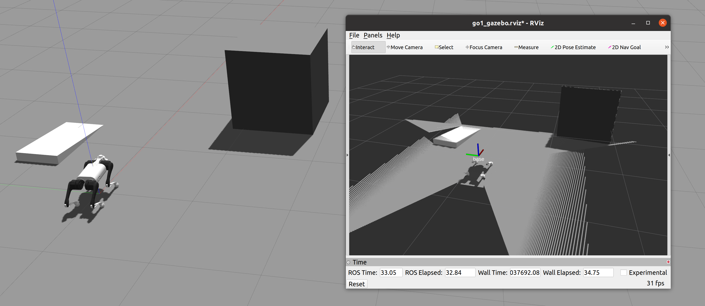

# Unitree Quadruped robot simulation - Python version

<p align="center">
    
</p>

This repository contains all the files and code needed to simulate the [a1](https://www.unitree.com/products/a1) & [go1](https://www.unitree.com/products/go1) quadrupedal robot using [Gazebo](http://gazebosim.org/) and [ROS](https://www.ros.org/).
The software runs on below envs

* [ROS noetic](http://wiki.ros.org/noetic) and [Ubuntu 20.04](http://www.releases.ubuntu.com/20.04/). 
* [ROS melodic](http://wiki.ros.org/melodic) and [Ubuntu 18.04](http://www.releases.ubuntu.com/18.04/).
* There's also [Docker Hub Image](https://hub.docker.com/repository/docker/tge1375/unitree_sim) but I recommend to use native environment for performance.

## Setup

* Clone Codes

```
cd <your-ws>/src
# melodic-version
git clone https://github.com/kimsooyoung/a1_sim_py.git
# noetic-version
git clone https://github.com/kimsooyoung/a1_sim_py.git -b noetic-devel
```

* Install Additional Pkgs

```
sudo apt-get install ros-$ROS_DISTRO-controller-manager \
	ros-$ROS_DISTRO-joint-state-publisher-gui \
	ros-$ROS_DISTRO-joint-state-controller \
	ros-$ROS_DISTRO-teleop-twist-keyboard \
	ros-$ROS_DISTRO-position-controllers \
	ros-$ROS_DISTRO-gazebo-ros-control \
	ros-$ROS_DISTRO-effort-controllers \
	ros-$ROS_DISTRO-teleop-twist-joy \
	ros-$ROS_DISTRO-gazebo-ros-pkgs \
	ros-$ROS_DISTRO-twist-mux \
	ros-$ROS_DISTRO-xacro
```

* Build Pkgs one by one (It's okay to use `catkin_make` for build all)

```
catkin_make --only-pkg-with-deps quadruped_unitree && source devel/setup.bash
catkin_make --only-pkg-with-deps a1_joystick && source devel/setup.bash

catkin_make --only-pkg-with-deps a1_controller && source devel/setup.bash
catkin_make --only-pkg-with-deps go1_controller && source devel/setup.bash

catkin_make --only-pkg-with-deps a1_description && source devel/setup.bash
catkin_make --only-pkg-with-deps go1_description && source devel/setup.bash

catkin_make --only-pkg-with-deps a1_gazebo && source devel/setup.bash
catkin_make --only-pkg-with-deps go1_gazebo && source devel/setup.bash
```

* Make Python Codes executable

```
cd <code-dir>
chmod +x a1_joystick/scripts/ramped_joystick.py
chmod +x a1_controller/scripts/robot_controller_gazebo.py
chmod +x go1_controller/scripts/robot_controller_gazebo.py
chmod +x quadruped_unitree/scripts/*.py
```

> If you just wanna try this and don't care about anything about ros, gazebo, etc... Just use prepared docker image

```
docker pull tge1375/unitree_sim:0.0.1
docker run -it -p 6080:80 --name unitree_sim --privileged tge1375/unitree_sim:0.0.1
# Open your web-browser and then connect to 
# http://127.0.0.1:6080/ 
```

You'll see images like belows

[] img

## Execution

* Example 1 - Robot Description

See how quadruped robot constructed and control each joints.

```
roslaunch go1_description go1_rviz.launch
```

<p align="center">
    
</p>

* Example 2 - Gazebo Execution

Walking quadruped robots within Gazebo Sim.

```
roslaunch quadruped_unitree go1_gazebo.launch

# Sometimes it falls over and we need to raise them by below command
rosrun quadruped_unitree respawn_robot.py

# Finally makes it walk!
rosrun teleop_twist_keyboard teleop_twist_keyboard.py cmd_vel:=/key_vel
```

<p align="center">
    
</p>

* Example 2 - AWS warehouse world 

Prepare external pkg from AWS

```
cd <your-ws>/src
git clone https://github.com/aws-robotics/aws-robomaker-small-warehouse-world.git
cd ../

catkin_make --only-pkg-with-deps aws_robomaker_small_warehouse_world && source devel/setup.bash
```

And then modify `simulation.launch` in `go1_gazebo` pkg.

```
<arg name="world_file_name" default="no_roof_small_warehouse"/>
<!-- <arg name="world_file_name" default="normal"/> -->
```

Finally, Run example again!

```
roslaunch quadruped_unitree go1_gazebo.launch
```

<p align="center">
    
</p>

---

## Future Work

- [ ] Stairs Climbing
- [ ] Update Walking Pace
- [ ] Template based leg control (Ground Reaction Force required)
- [ ] Reinforcement learning (Will be fun)
- [ ] Autonomous Walking
- [ ] Sensor Fusion and Tracking

## Credits
 - lnotspotl: https://github.com/lnotspotl/a1_sim_py
 - mike4192: https://github.com/mike4192/spotMicro
 - Unitree Robotics: https://github.com/unitreerobotics/a1_ros
 - QUADRUPED ROBOTICS: https://quadruped.de
